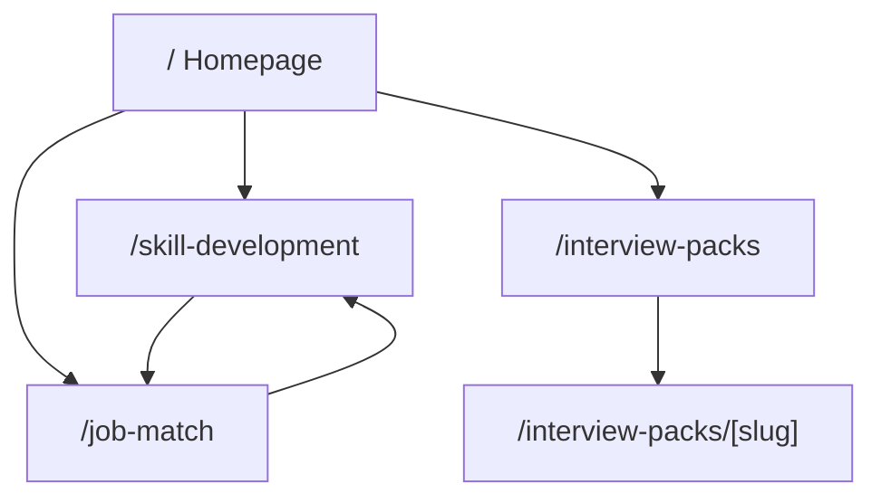
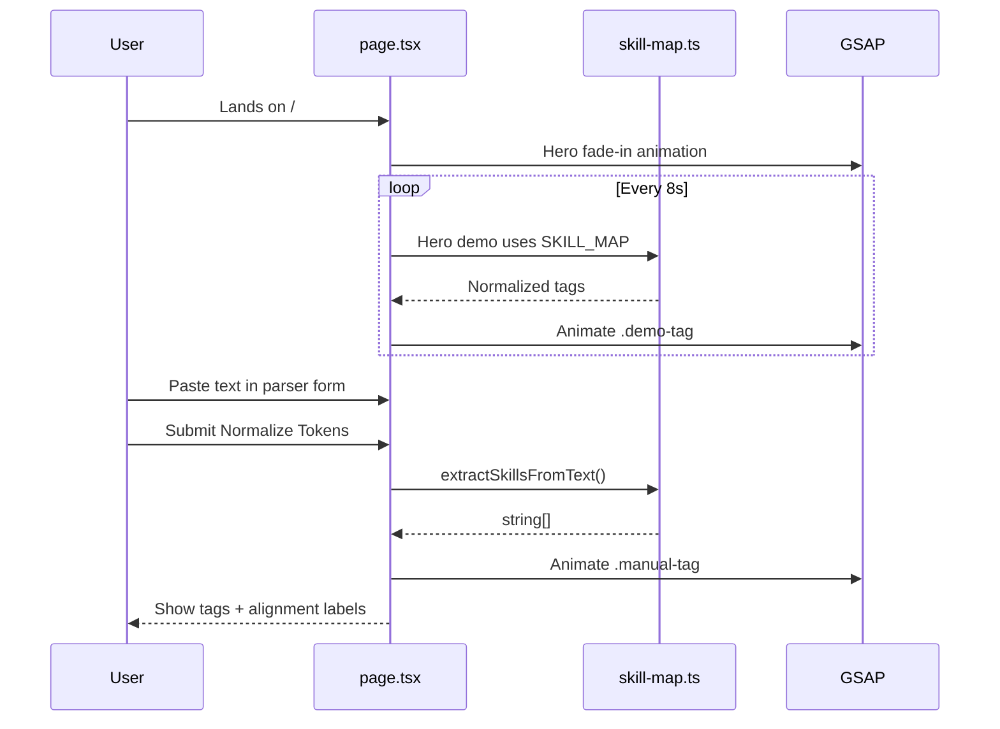
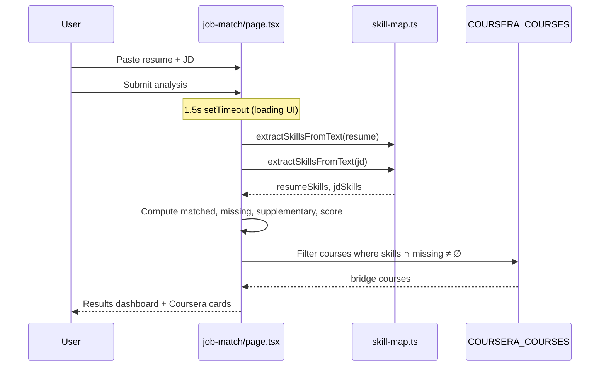
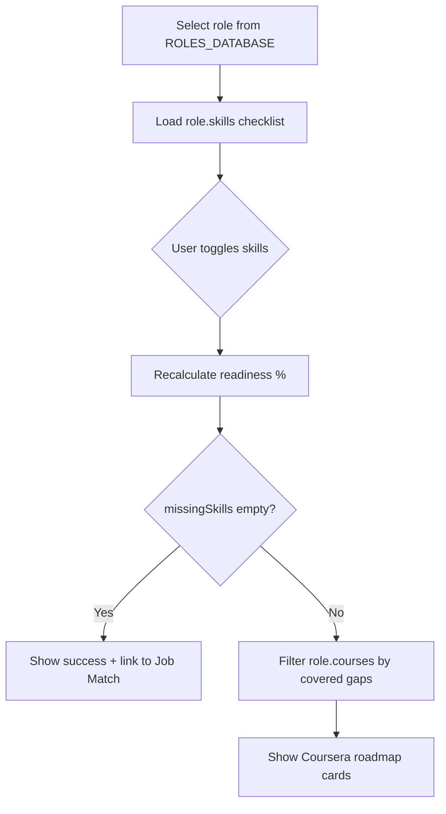
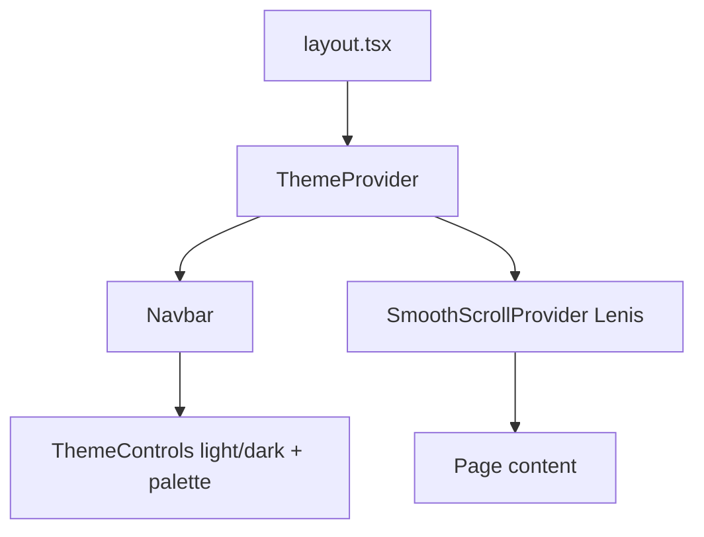

# SortMySkills — Application Flow

Visual and narrative flows for reviewers. Pair this with [HOW_IT_WORKS.md](./HOW_IT_WORKS.md) for implementation detail.

---

## Site map (all routes)



---

## Primary user journeys

### Journey A — “I don’t know what to learn”

```text
Homepage
  → Read value prop + watch hero normalization demo
  → Click "Build Skill Roadmap"
  → /skill-development
  → Pick target role (e.g. Frontend Engineer)
  → Check skills you already have
  → See readiness % + chart
  → If gaps: view Coursera course cards for missing skills
  → Optional: open Coursera in new tab
```

### Journey B — “Am I qualified for this job?”

```text
Homepage or Navbar
  → "Job Match Analysis" or "Comparator"
  → /job-match
  → Paste resume (or Load Sample Datasets)
  → Paste job description
  → Calculate Competency Gaps
  → View match % + Aligned / Gaps / Supplementary columns
  → Browse Coursera bridge courses for missing skills
  → Reset → analyze another JD
```

### Journey C — “I want interview practice”

```text
Homepage or Navbar
  → "Interview Packs"
  → /interview-packs
  → Choose role card (e.g. Backend Engineer)
  → /interview-packs/backend-engineer
  → Filter Easy / Medium / Hard
  → Study questions offline or in mock interviews
```

### Journey D — “Try the parser only”

```text
Homepage
  → Section: "Test the Standardizing Parser"
  → Paste chaotic skill text
  → Normalize Tokens
  → See canonical tags + discipline hint
```

---

## Homepage flow (detailed)



---

## Job Match flow (detailed)



---

## Skill Development flow (detailed)



**Note:** No text parser on this page — skills come from predefined role blueprints.

---

## Interview packs flow

```mermaid
flowchart LR
  A[/interview-packs] --> B[INTERVIEW_PACKS from index.ts]
  B --> C[User clicks role]
  C --> D[getInterviewPackBySlug]
  D --> E[Render 100 questions]
  E --> F{Filter difficulty}
  F --> E
```

---

## Global chrome (every page)



---

## State persistence today

| Data | Persists? | Where |
|------|-----------|--------|
| Theme mode | ✅ | `localStorage` `sortmyskills-theme-mode` |
| Color pack | ✅ | `localStorage` `sortmyskills-color-pack` |
| Parser input | ❌ | React state — lost on refresh |
| Job match texts | ❌ | React state |
| Skill audit checkboxes | ❌ | React state |
| Interview filter | ❌ | React state |

---

## Suggested live demo script (5 minutes)

1. **Homepage (1 min)** — Hero demo → parser paste test → point at `skill-map.ts`.
2. **Skill Development (1.5 min)** — Switch roles → toggle skills → show chart + roadmap.
3. **Job Match (1.5 min)** — Load samples → run analysis → explain score formula.
4. **Interview Packs (0.5 min)** — Open one pack → filter Hard questions.
5. **Theme (0.5 min)** — Toggle light mode + switch accent pack.

Close with [ROADMAP.md](./ROADMAP.md) — what is planned next.
