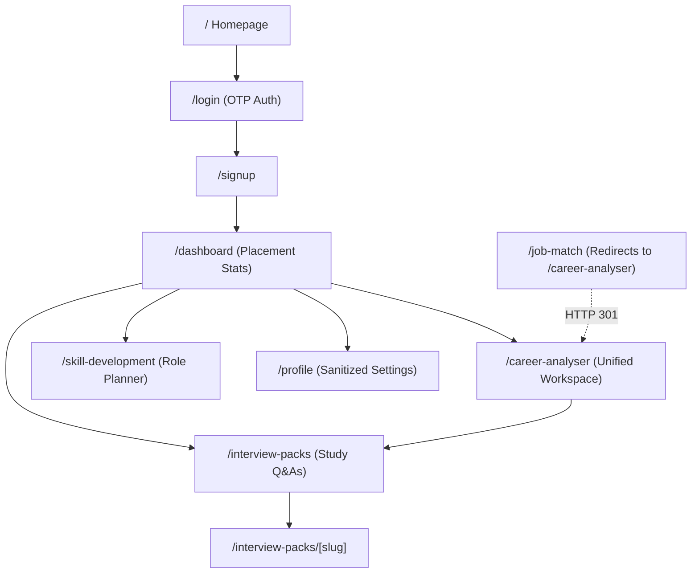

# SortMySkills — Application Flow

This document details the visual and narrative flows of SortMySkills, including primary user journeys, state persistence, and a live review demo script.

---

## Site Map (All Routes)

---

## Primary User Journeys

### Journey A — "I don't know what to learn" (Skill Planner)
1. **Dashboard / Navigation**: Click "Skill Planner" or go to `/skill-development`.
2. **Role Blueprint**: Choose a career track from the roles sidebar (e.g. Frontend Engineer).
3. **Audit Baseline**: Review and check off baseline skills you already possess.
4. **Acquire Gaps**: Toggle metrics to calculate readiness %; remaining gaps automatically display curated Coursera course recommendations to bridge knowledge.

### Journey B — "Am I qualified for this specific job?" (Unified Analyser)
1. **Dashboard / Navigation**: Click "Audit Resume & Fit" or go to `/career-analyser`.
2. **Setup Inputs**: Paste your resume and the target Job Description (JD).
3. **Readiness Scan**: Execute the "Scan Readiness Score" check to analyze format, action verbs, keyword density, and contact details.
4. **Gap Analysis**: Execute the "Check Skill Gaps" check to parse and isolate matching, missing, and bonus canonical skills.
5. **Dynamic Roadmap**: Input target timeline dates and optional focus areas, then click "Generate Study Plan" to render an AI week-by-week roadmap.
6. **Data Deletion**: Delete all saved analyses permanently if desired.

### Journey C — "I want interview practice"
1. **Dashboard / Navigation**: Click "Interview Packs" or go to `/interview-packs`.
2. **Catalog Selector**: Choose a track family pack (e.g., Backend Engineer).
3. **Structured Q&A**: Filter cards by difficulty (Easy, Medium, Hard) to practice study questions.

---

## State Persistence Map

| Data Category | Saved in LocalStorage? | Saved in Supabase DB? | Description / Key Name |
|---------------|------------------------|-----------------------|-------------------------|
| **Theme & Accent** | ✅ Yes | ❌ No | Mode: `sortmyskills-theme-mode`   Accent: `sortmyskills-color-pack` |
| **Workspace Inputs** | ✅ Yes (partial) | ✅ Yes | Saved to `public.analysis_sessions` automatically upon scanning or generating a roadmap. |
| **Target Date & Focus** | ✅ Yes | ✅ Yes | Saved to `analyser_target_date` / `analyser_focus_areas` & Supabase. |
| **Roadmap Milestones**| ✅ Yes | ❌ No | Milestone checkboxes tracked via `roadmap_milestones`. |
| **Sanitized User Profile**| ❌ No | ✅ Yes | Display name and targets synced with `public.profiles`. |

---

## Suggested Live Demo Script (5 minutes)

1. **Authentication & Welcome (1 min)**
   * Log in with OTP. Land on the unified `/dashboard`. Show user profile initials and stats (Comparisons, Completed Audits).
2. **Skill Planner (1 min)**
   * Go to `/skill-development`. Switch roles, toggle a few checkboxes, and show the Recharts bar chart comparing required vs possessed skills.
3. **Career Analyser (2 min)**
   * Go to `/career-analyser`.
   * Click **Load demo sample** to load John Doe and TechCorp. Point out the "Demo data loaded" warning banner.
   * Run the **Readiness Scan** and scroll through the structural subscores.
   * Run the **Gap Analysis** and show the missing skill badges.
   * Choose a target date (e.g., 4 weeks out) and click **Generate Study Plan**. Show the AI week-by-week timeline using verified learning resources.
   * Demonstrate **milestone checklist** clicks.
4. **Data Privacy Deletion (0.5 min)**
   * Scroll up and click **Delete Saved Analysis Data**. Confirm the popup and show that all inputs, roadmaps, and local storage values are cleanly reset.
5. **Theme system (0.5 min)**
   * Navigate back to the homepage `/` or dashboard. Toggle dark/light modes and switch between accent palettes (Terracotta, Neon, Amber, Slate).
