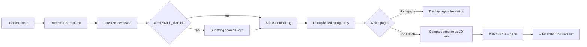

# How SortMySkills Works (Technical Explanation)

This document explains **how the app actually behaves under the hood** — especially the skill parser — so you can describe it clearly to a reviewer without overselling it as “real AI.”

---

## Big picture in one sentence

SortMySkills is a **client-side Next.js app** that (1) **normalizes messy skill text** using a dictionary lookup, (2) **compares two skill lists** (resume vs job description or user vs role), and (3) **surfaces static Coursera + interview content** to help users study intentionally.

There is **no backend API**, **no LLM**, and **no database** in the current build. Everything runs in the browser after the page loads.

---

## The skill parser (core engine)

### Where it lives

| File | Role |
|------|------|
| `src/lib/skill-map.ts` | `SKILL_MAP` dictionary + `extractSkillsFromText()` function |
| `src/app/page.tsx` | Homepage demo + manual “Normalize Tokens” form |
| `src/app/job-match/page.tsx` | Resume + JD both passed through the same function |

**One function, three UIs.** That is an intentional design choice: same rules everywhere so behavior is consistent.

### What `SKILL_MAP` is

`SKILL_MAP` is a plain JavaScript object:

```text
alias (lowercase key)  →  canonical tag (display name)
```

Examples:

```text
"reactjs"     →  "React"
"py"          →  "Python"
"k8s"         →  "DevOps"
"amazon web services"  →  "AWS"
```

Think of it as a **controlled vocabulary** or **taxonomy index** — not machine learning. When a reviewer asks “how does NLP work here?”, the honest answer is:

> We use **rule-based token matching** against a curated alias registry. It is fast, deterministic, and runs entirely in the browser.

### Step-by-step: `extractSkillsFromText(text)`

Given any string (resume, JD, or pasted skills):

**Step 1 — Tokenize**

```text
input → lowercase → split on commas, spaces, newlines, hyphens, colons, parentheses
```

Example:

```text
"I deployed docker on GCP and use graphql"
→ ["i", "deployed", "docker", "on", "gcp", "and", "use", "graphql"]
```

**Step 2 — Direct lookup**

For each token, if `SKILL_MAP[token]` exists, add the canonical value (e.g. `docker` → `DevOps`).

**Step 3 — Fuzzy / substring pass**

If no direct hit, loop every key in `SKILL_MAP` and match if:

- token equals key, **or**
- token contains key, **or**
- key contains token  

(and token length > 1, to avoid noise from single letters).

Example: token `reactjs` contains key `reactjs` → `React`.

**Step 4 — Deduplicate**

Results are stored in an array; duplicates are skipped with `includes()` checks.

**Step 5 — Return**

Returns `string[]` of canonical tags, e.g. `["DevOps", "Google Cloud", "GraphQL"]`.

### Important limitations (say these to reviewers)

| Limitation | Why it matters |
|------------|----------------|
| Only knows skills in `SKILL_MAP` | Unknown tools return nothing or “No Standard Tag Detected” on homepage |
| Substring matching can over-match | Short tokens might accidentally match keys |
| No ranking or confidence score | Every match is binary: in or out |
| No PDF/DOCX parsing | Users paste **plain text** only |
| English-oriented aliases | Non-English resumes are not handled |

These are **documented tradeoffs** for a v1 local demo, not bugs you are hiding.

### Homepage hero demo (slightly different loop)

The hero panel does **not** call `extractSkillsFromText()` directly. It uses the same `SKILL_MAP` but splits on **commas** only and checks `raw.includes(key)` for each dictionary key. It also **auto-cycles** sample strings every 8 seconds with GSAP tag animations.

Purpose: **visual storytelling**, not a second parser.

### Interactive playground (`page.tsx` form)

On submit:

1. `extractSkillsFromText(inputText)` runs.
2. Tags render in the “Parsed Node Blueprint” panel.
3. GSAP animates tag entrance.
4. Heuristic labels appear (e.g. “Frontend Engineering” if React/Tailwind detected) — **hardcoded if/else**, not ML.

---

## Job Match Analysis (`/job-match`)

### Flow

```text
User pastes Resume text + JD text
        ↓
Click "Calculate Competency Gaps"
        ↓
1.5s simulated loading (setTimeout — UX only)
        ↓
parsedResume = extractSkillsFromText(resume)
parsedJD     = extractSkillsFromText(jd)
        ↓
matched        = JD skills that appear in resume
missing        = JD skills NOT in resume
supplementary  = resume skills NOT required by JD
score          = (matched.length / parsedJD.length) × 100
        ↓
getCourseraBridges(missing) filters static COURSERA_COURSES array
```

### Match score formula

```text
matchScore = round( (|matched| / |parsedJD|) × 100 )
```

If the JD parser finds **zero** skills, score is `0` (avoid divide-by-zero).

### Coursera “bridges”

`COURSERA_COURSES` is a **static array** in `job-match/page.tsx`. A course is shown if **any** of its `skills` overlap the `missing` list.

No Coursera API — links are built as:

```text
https://www.coursera.org/search?query={courseTitle}
```

---

## Skill Development (`/skill-development`)

This module does **not** use the text parser. It uses **checkbox state**:

```text
ROLES_DATABASE[]  →  each role has a fixed skills[] list
userSkills[]      →  skills the user toggles on
readiness %       →  (checked ∩ required) / required × 100
missingSkills     →  required − checked
```

### Roadmap logic

For each course on the role:

- Compute `coveredGaps = course.skills ∩ missingSkills`
- If `coveredGaps.length > 0`, show that course card
- Otherwise hide it

### Chart

Recharts bar chart compares “Required” (always 10) vs “Current” (10 if user has skill, else 2). Bar color uses `var(--accent-primary)` from the theme system.

---

## Interview packs (`/interview-packs`)

Pure **read-only content**:

- Data lives in `src/data/interview-packs/*.ts` as string arrays.
- `buildPack()` assigns `id`, `difficulty`, and `text` per question.
- `index.ts` exports `INTERVIEW_PACKS` and `getInterviewPackBySlug()`.
- Detail page filters client-side by `easy | medium | hard`.

No quiz scoring, no spaced repetition — a **structured question bank** for study and mock interviews.

---

## Theming system

| Piece | Behavior |
|-------|----------|
| `ThemeProvider` | Reads/writes `localStorage`, sets `html` class `light` or `dark` |
| `layout.tsx` inline script | Applies theme before paint (reduces flash) |
| `globals.css` | CSS variables for background, borders, text |
| `themes.ts` | Four accent packs; sets `--accent-primary` and `--accent-secondary` |
| Tailwind `@theme` | Maps `accent-green` / `accent-cyan` to those CSS variables |

Logo SVG gradient reads `var(--accent-primary)` so it updates with the palette picker.

---

## Animation & scroll

| Library | Usage |
|---------|--------|
| **GSAP** | Hero fade-in, pathway card hover, tag pop, job-match results entrance |
| **Lenis** | Smooth scroll on all pages via `SmoothScrollProvider` |

ScrollTrigger is **not** wired yet (listed on roadmap).

---

## What is mocked vs real

| Feature | Real? | Notes |
|---------|-------|-------|
| Skill normalization | ✅ Real (rule-based) | Limited to `SKILL_MAP` size |
| Match percentage | ✅ Real | Based on parsed tags only |
| Readiness % | ✅ Real | Based on checkbox state |
| Coursera catalog | ⚠️ Static | Hand-curated list, not live API |
| Salary ranges | ⚠️ Static | Illustrative numbers in `ROLES_DATABASE` |
| “Local NLP” label on UI | ⚠️ Marketing | Means local/browser, not neural NLP |
| Auth / accounts | ❌ None | |
| Saving progress | ❌ None | Refresh loses state |
| PDF resume upload | ❌ None | Paste text only |

Being explicit about this builds trust with reviewers.

---

## Data flow diagram (parser path)



---

## How to demo the parser live (30 seconds)

1. Open `/` → scroll to **“Test the Standardizing Parser”**.
2. Paste: `I deployed a docker container on GCP and query with graphql`.
3. Click **Normalize Tokens**.
4. Show tags: **DevOps**, **Google Cloud**, **GraphQL**.
5. Open `src/lib/skill-map.ts` and point at the exact keys.

Then open `/job-match` → **Load Sample Datasets** → run analysis → show gap list and score.
