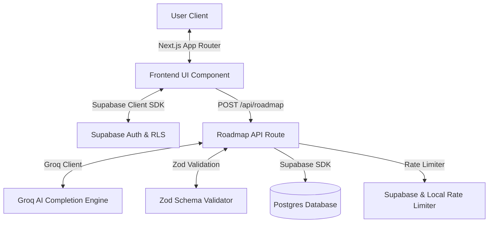

# How SortMySkills Works (Technical Explanation)

This document explains **how the SortMySkills platform behaves under the hood** — outlining the parsing engine, AI study roadmap, rate-limiting, and database synchronization systems.

---

## Big Picture Architecture

SortMySkills is a secure, authenticated **Next.js SaaS application** backed by **Supabase Database & Auth**, utilizing **Groq AI** for personalized study path generation.

---

## 1. The Skill Parser & Normalization

### Where it lives

| File | Role |
|------|------|
| [src/lib/skill-map.ts](file:///d:/Projects/SortMySkills/src/lib/skill-map.ts) | `SKILL_MAP` taxonomy registry, category mapping, and parsing functions |
| [src/app/page.tsx](file:///d:/Projects/SortMySkills/src/app/page.tsx) | Homepage marketing hero & live client-side parse demo |
| [src/app/(app)/career-analyser/page.tsx](file:///d:/Projects/SortMySkills/src/app/%28app%29/career-analyser/page.tsx) | Unified analysis workspace using the parser for Readiness Scans and Job Matching |

### What the parser does
The parser uses **rule-based token matching** against a controlled taxonomy of standard technologies.

1. **Tech Name Protection**: Protects special strings (`next.js` → `nextjs`, `c++` → `cpp`, etc.) and multi-word phrases from splitting.
2. **Tokenization**: Standardizes to lowercase and splits on common delimiters (commas, spaces, newlines, hyphens, colons, brackets).
3. **English False Positive Filters**: Special checks prevent common English verbs from mapping to technical terms (e.g. "Let's go build" won't register as the `Go` programming language).
4. **Canonical Lookup & Categories**: Tokens are matched to canonical tags and associated with specialized categories (e.g., `Pandas` → `Data Science & Analytics`, `PyTorch` → `AI & Machine Learning`).
5. **Deduplication & Proficiency Analysis**: Returns unique normalized skill tags with heuristics estimating proficiency level (e.g. `beginner`, `moderate`, `expert`).

---

## 2. Job Match & Resume Readiness Scoring

In the unified `/career-analyser` workspace, users run two instant, local scans:

### Resume Readiness (Formerly ATS Compatibility)
Estimates a resume's completeness and recruiter software compatibility across 5 distinct weighting factors:
* **Keyword Match (35%)**: Density overlap of canonical terms in the resume compared to the Job Description (JD).
* **Format & Structure (20%)**: Identification of standard sections (Experience, Education, Skills, Projects, Summary).
* **Word Count Sweetspot (15%)**: Evaluates word density (aims for 400-800 words).
* **Recruiter Tones (15%)**: Scans for action verbs (e.g., *built*, *led*, *optimized*).
* **Contact Integrity (15%)**: Confirms completeness of vital links (email, phone, LinkedIn, GitHub, portfolio).

### Skill Gap Analysis
Examines candidate taxonomy overlaps and splits requirements into:
* **Skills You Have**: Direct keyword overlap.
* **Missing Skills**: Requirements in the JD that aren't declared in the resume. Recommends direct **Course Bridges** from a curated list of Coursera classes.
* **Bonus Skills**: Candidate strengths not strictly listed in the target JD.

---

## 3. AI-Powered Roadmaps & Resource Verification

When a user requests a Study Plan, `/api/roadmap` performs secure, schema-validated completion:

1. **Authentication Check**: The route verifies the active user session server-side.
2. **Rate Limit Shield**: Persistent window-based rate-limits permit maximum 3 requests per 15 minutes.
3. **Skill-Matched Resources**: The system searches our local registry of 14 curated free educational resources (e.g. MDN, roadmap.sh, The Odin Project) and injects only relevant ones into the Groq prompt.
4. **AI Generation & Repair**: The model produces a week-by-week transition path matching the user's available time.
5. **Zod Validation**: Zod parses and asserts the JSON schema shape on the raw AI output before saving or returning.
6. **Strict Resource Validation**: The backend filters the AI roadmap output, comparing every recommended resource against our verified local registry. If an AI resource is fake or unverified, it is completely stripped, preventing resource hallucinations from reaching the client.

---

## 4. Supabase DB Persistence & User Privacy

All analyses and roadmap parameters are synchronized automatically to the cloud:

* **Supabase Migration**: The system uses a manual-run safe schema migration at `[supabase/migrations/001_init.sql](file:///d:/Projects/SortMySkills/supabase/migrations/001_init.sql)` to deploy all tables, triggers, indexes, and RLS policies.
* **Persistence**: Every scan or study plan generation updates the user's active database record in `analysis_sessions`. This enables automatic reload when re-logging.
* **Row Level Security (RLS)**: Policies prevent cross-account reading. Users can only select, insert, or delete rows associated with their authenticating `auth.uid() = user_id`.
* **Privacy Data Deletion**: Users can permanently clear their resume, JD, history, and localStorage milestones using the "Delete Saved Analysis" button, which calls the secure `deleteMyAnalysisSessionsAction` server action.

---

## 5. What is Mocked vs. Real

| Feature | Real? | Description |
|---------|-------|-------------|
| **Skill Parser** | ✅ Real | Tokenizes text, removes stopwords, protects syntax, and maps to categories. |
| **Authentication** | ✅ Real | Supabase OTP Email Login protecting app routes via middleware. |
| **Readiness Scans** | ✅ Real | Pure rule-based weighting of structural variables. |
| **Study Roadmaps** | ✅ Real | AI-generated study timelines backed by Groq and validated by Zod schemas. |
| **DB Sync** | ✅ Real | Postgres synchronization on session updates with secure deletion. |
| **Rate Limiter** | ✅ Real | Windowed IP/User database rate-limiting with memory fallbacks. |
| **Coursera Catalog** | ⚠️ Static | Curated list of course references, not live Coursera API queries. |
