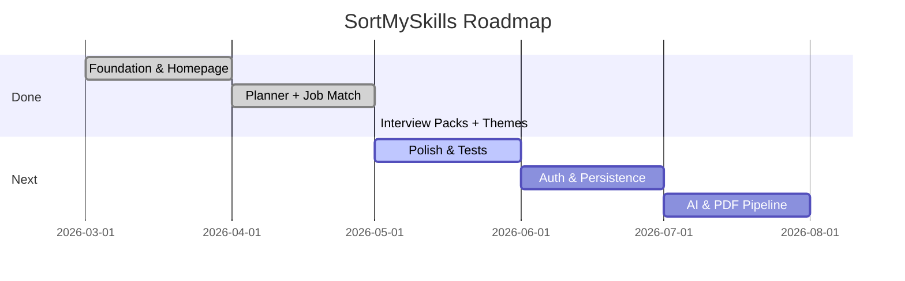

# SortMySkills — Product & Engineering Roadmap

Progress snapshot for reviewers and the team. Update this file as milestones ship.

**Last updated:** May 2026 · **Version:** 0.1.0 (prototype)

---

## Status legend

| Symbol | Meaning |
|--------|---------|
| ✅ | Done and in `main` |
| 🚧 | In progress / partial |
| 📋 | Planned, not started |
| 💡 | Future idea |

---

## Phase 0 — Foundation ✅

| Item | Status | Notes |
|------|--------|-------|
| Next.js 15 App Router setup | ✅ | `src/app/` structure |
| Editorial homepage | ✅ | Hero, pathways, parser playground, philosophy |
| Geist fonts + Tailwind 4 | ✅ | `globals.css` `@theme` |
| GSAP hero animations | ✅ | `page.tsx` |
| Lenis smooth scroll | ✅ | `SmoothScrollProvider` |
| Shared Navbar + Logo | ✅ | `src/components/` |
| Documentation folder | ✅ | `docs/*.md` |

---

## Phase 1 — Core tools ✅

| Item | Status | Notes |
|------|--------|-------|
| Skill normalization registry | ✅ | `src/lib/skill-map.ts` |
| `extractSkillsFromText()` | ✅ | Used on homepage + job-match |
| Cloud/DevOps aliases (AWS, GCP, Docker, etc.) | ✅ | In `SKILL_MAP` |
| Skill Development planner | ✅ | 5 roles, readiness %, Recharts |
| Job Match Analysis | ✅ | Resume vs JD, gap matrix, score |
| Static Coursera recommendations | ✅ | Homepage + both tools |
| Sample resume/JD datasets | ✅ | `job-match/page.tsx` |

---

## Phase 2 — Content & theming ✅

| Item | Status | Notes |
|------|--------|-------|
| Terracotta default accent palette | ✅ | Was neon green/cyan originally |
| Light + dark mode | ✅ | `ThemeProvider`, journal light theme |
| 4 accent color packs | ✅ | Terracotta, Neon, Amber, Slate |
| Theme flash prevention | ✅ | Inline script in `layout.tsx` |
| SkillQore interview packs (6 × 100) | ✅ | `src/data/interview-packs/` |
| Interview packs UI | ✅ | Catalog + `[slug]` detail + filters |
| Homepage interview CTA | ✅ | Links to `/interview-packs` |
| Docs: structure, functionality, themes | ✅ | See `docs/` |

---

## Phase 3 — Polish & accuracy 🚧

| Item | Status | Notes |
|------|--------|-------|
| Unify hero demo with `extractSkillsFromText` | 📋 | Hero still uses comma-only loop |
| GSAP ScrollTrigger on scroll sections | 📋 | Prompt in `homepage_prompts.md` |
| Backend Engineer in Skill Development roles | 📋 | Pack exists; planner has 5 roles only |
| Replace hardcoded chart/tooltip colors | 🚧 | Mostly uses CSS variables now |
| Mobile nav menu | 📋 | Nav links hidden below `lg` |
| Accessibility audit (ARIA, focus) | 📋 | |
| Unit tests for `extractSkillsFromText` | 📋 | |

---

## Phase 4 — Backend & persistence 📋

| Item | Status | Notes |
|------|--------|-------|
| User accounts / auth | ✅ | Implemented complete email OTP verification flow |
| Save resume profiles & analyses | 📋 | |
| Expand `SKILL_MAP` via admin or API | 📋 | |
| Real Coursera or course API integration | 📋 | |
| PDF/DOCX resume upload + text extraction | 📋 | |
| Server-side parser endpoint | 📋 | Optional if client map grows large |

---

## Phase 5 — Intelligence layer 💡

| Item | Status | Notes |
|------|--------|-------|
| LLM-assisted skill extraction | 💡 | Fallback when alias map misses |
| Synonym expansion / embeddings | 💡 | |
| Job description URL scraper | 💡 | |
| Personalized study schedule | 💡 | |
| Interview pack quiz mode + scoring | 💡 | |
| Spaced repetition for questions | 💡 | |

---

## Phase 6 — Production 💡

| Item | Status | Notes |
|------|--------|-------|
| Deploy to Vercel | 📋 | README mentions Vercel |
| Analytics (privacy-safe) | 💡 | |
| SEO + Open Graph per route | 📋 | |
| Performance budget / Lighthouse pass | 📋 | |
| E2E tests (Playwright) | 📋 | |

---

## What we did so far (summary for slides)

```text
✅ Built full marketing homepage with live skill normalization demo
✅ Implemented shared rule-based parser (SKILL_MAP + extractSkillsFromText)
✅ Shipped Skill Development planner with readiness % and charts
✅ Shipped Job Match comparator with gap analysis + Coursera bridges
✅ Added 600 interview questions across 6 roles with browse/filter UI
✅ Added light/dark mode + 4 swappable accent color packs
✅ Wrote reviewer documentation (parser, flows, roadmap, code guide)
```

---

## What is yet to do (priority order)

1. **ScrollTrigger** section reveals (homepage polish).  
2. **Backend Engineer** in skill planner + align roles with interview packs.  
3. **Parser tests** + unify hero demo logic.  
4. **Mobile navigation** hamburger menu.  
5. **Persistence** — save analyses (needs backend).  
6. **PDF resume upload** (needs parser pipeline).  
7. **Optional AI layer** for unknown skills (post-v1).

---

## Milestone timeline (suggested)



---

## How to keep this roadmap current

When you ship a feature:

1. Move its row from 📋/🚧 to ✅ in this file.  
2. Add a one-line note in `README.md` if it is user-visible.  
3. Update [FUNCTIONALITY.md](./FUNCTIONALITY.md) if behavior changed.
