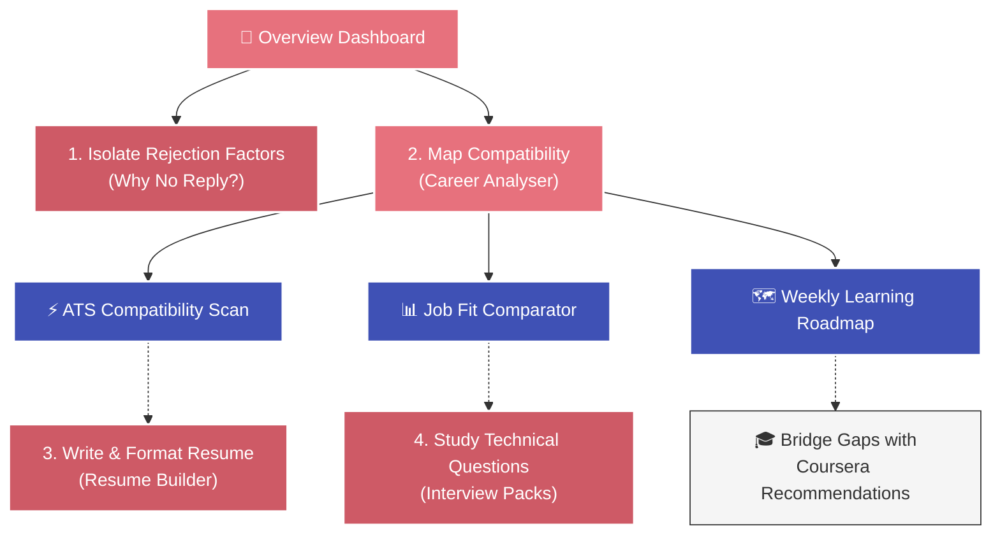
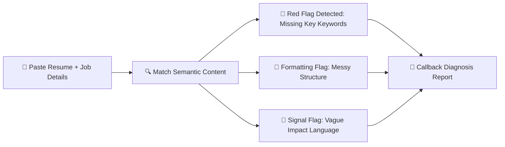
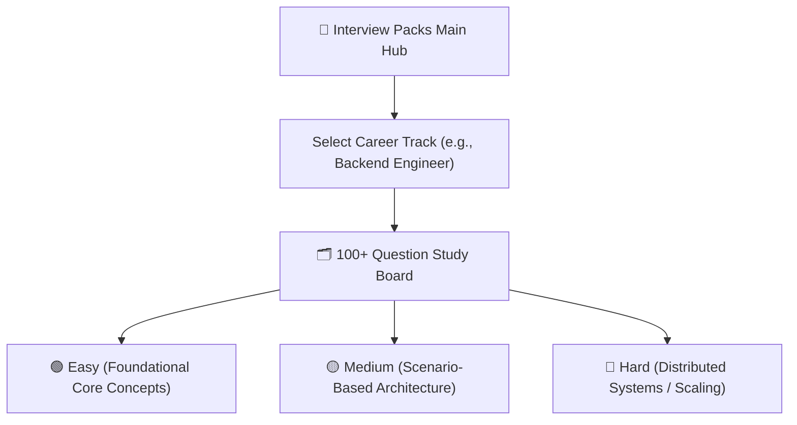
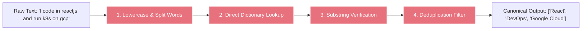

# 🚀 SortMySkills: The Ultimate Beginner's Visual Guide

Welcome to **SortMySkills**! Whether you are a job seeker aiming to land your dream tech role, a developer polishing your skills, or a beginner curious about how resume filtering works, this guide is designed for you. 

SortMySkills is an offline-first, highly optimized platform designed to evaluate your current readiness, isolate why recruiters may not be responding, and construct concrete learning roadmaps to bridge your skill deficits. 

Below is an interactive, step-by-step tour of every single feature, explaining **what it is**, **how it works under the hood**, **how to use it**, and **how to interpret your results**!

---

## 🗺️ The Big Picture: How All Features Connect

Before we dive into the details, see how you can navigate the entire platform like a pro:



---

## 🎨 Feature Deep-Dives

### 1. 👋 The Overview Dashboard & Profile Calibrator
The **Overview Dashboard** is your command center. Instead of just displaying static charts, it acts as an intelligent career coach that looks at your profile and state to tell you *exactly* what step you should take next.

```text
+-------------------------------------------------------------+
|  👋 Welcome Back, Friend!                                    |
|  "Let's turn your resume into recruiter-ready proof."        |
|                                                             |
|  [!] COACH RECOMMENDS:                                      |
|  "Map your resume against a target JD to find gaps."        |
|  [ Audit ATS & Fit ] <--- Primary Recommended Action Button |
+-------------------------------------------------------------+
```

#### ⚙️ How It Works Under the Hood
1. **Dynamic Coach Logic:** Checks if you have a target role configured. If not, it prompts you to set one. If you have no history, it tells you to run **Why No Reply** first. If it detects unfinished inputs stored in your browser's workspace, it prompts you to resume scanning in **Career Analyser**.
2. **Placement Engine Stats:** Synthesizes metrics like **Detected Resume Signals** (the skills it found in your resume) and **Analysis Runs** securely using your offline-first browser database.

#### 🚶‍♂️ Step-by-Step for Beginners
1. **Land on Dashboard:** Check the **Coach Recommendation** card at the top.
2. **Check your Stats:** Review your active competency score or skill counts.
3. **Calibrate:** Click **Profile** in the navigation sidebar to update your target role (e.g., *Frontend Engineer*, *Backend Developer*). This adjusts the entire application's evaluation weights!

---

### 2. 🔇 "Why No Reply?" (Recruiter Callback Diagnosis)
Are you sending out dozens of resumes but getting met with absolute radio silence? The **Why No Reply** analyzer is a specialized diagnostic tool designed to pinpoint exactly why recruiters might be passing on your application.



> [!NOTE]
> This is the emotional "MVP" (Minimum Viable Product) hook of SortMySkills. It helps isolate **Structural**, **Semantic**, and **Role-Calibration** rejection factors.

#### ⚙️ How It Works Under the Hood
It parses your resume text and compares it against the target role's core expectations:
- **Structural Analyzer:** Looks at word count, density, and formatting signals.
- **Semantic Matcher:** Runs a keyword check to find if crucial industry verbs and technologies are completely missing.
- **Recruiter Emulation Heuristics:** Rates your callback probability based on real-world hiring patterns.

#### 🚶‍♂️ Step-by-Step for Beginners
1. Navigate to **Why No Reply**.
2. Paste your resume text in the left panel.
3. Paste the description or details of the job you applied for on the right.
4. Click **Diagnose Callback Probability**.
5. Read your **Rejection Vector Breakdown** to see if your resume got filtered out by human reviewers or automated systems.

---

### 3. 🧠 The Career Analyser (Unified 3-in-1 Workspace)
This is the **powerhouse** of the application. Instead of forcing you to switch tabs or upload your files multiple times, the **Career Analyser** lets you paste your resume and target job description **once**, and then triggers three powerful analysis modules progressively.

```
       +---------------------------------------------+
       |           Career Analyser Inputs            |
       |  [ Paste Resume ]      [ Paste Target JD ]  |
       +----------------------+----------------------+
                              |
                     (Click to Launch)
                              |
         +--------------------+--------------------+
         |                    |                    |
         v                    v                    v
  [ ATS Scan ]          [ Job Match ]      [ Career Roadmap ]
  Structure, Contact,   Requirements Gap   Weekly Actionable
  & Keyword Density.    & Course Bridges.  Learning Checklist.
```

#### ⚙️ How It Works Under the Hood
1. **Single-Input Workspace:** Your text is stored in a global state context (`ResumeContext`) so you don't lose it if you navigate between columns.
2. **The 3-Pillar Pipeline:**
   * **ATS Compatibility Scan:** Analyzes structural formatting, word count metrics, and contact detail presence.
   * **Job Match Comparator:** Computes a direct competency overlap score using our **Tokenizing Parser Engine**.
   * **Interactive Learning Roadmap:** Takes the identified skill deficits and constructs a weekly study guide complete with curated Coursera online learning courses.

#### 🚶‍♂️ Step-by-Step for Beginners
1. Go to **Career Analyser**.
2. **Input Once:** Paste your resume text and your target job description.
3. **Save/Load Sample:** If you are just testing, click **Load Sample Datasets** to populate simulated examples instantly.
4. **Trigger pillar 1 (ATS):** Click **Scan ATS Compatibility** to view your structural score out of 100.
5. **Trigger pillar 2 (Job Fit):** Click **Compare Job Fit** to see exact **Matched**, **Missing**, and **Supplementary** skills.
6. **Trigger pillar 3 (Roadmap):** Input your target "Job Ready" date and click **Generate Roadmap** to create a custom study calendar!

---

### 4. ✍️ The Resume Builder
Your resume needs to be clean, readable, and dense with high-value technical keywords. The **Resume Builder** provides a clean, elegant typing studio to help you assemble standard layouts.

```text
+------------------------------------+------------------------------------+
|  [📝 Edit Section]                 |  [📄 Live Pre-Render]              |
|  Full Name: Jane Doe               |  JANE DOE                          |
|  Role: Senior Frontend Engineer    |  Senior Frontend Engineer          |
|  Summary: Deployed robust web...   |  --------------------------------  |
|                                    |  Deployed robust web apps using    |
|  [+] Add Technical Experience      |  React, Next.js, and TypeScript... |
+------------------------------------+------------------------------------+
```

#### ⚙️ How It Works Under the Hood
- Generates fully styled, highly printable HTML resume structures.
- Evaluates line item bullet points for action verbs (e.g., *"Managed"*, *"Spearheaded"*, *"Optimized"*) versus passive language (e.g., *"Responsible for"*).

#### 🚶‍♂️ Step-by-Step for Beginners
1. Go to **Resume Builder**.
2. Fill out your contact details, objective, and skills.
3. Under experience, write clear bullet points describing your impact (numbers, technologies used, and outcomes).
4. Watch the live pre-render pane format your resume beautifully in real-time.
5. Copy or print your recruiter-ready document!

---

### 5. 📚 Role-Based Interview Packs
Passing the resume screen is only half the battle. The **Interview Packs** module is a comprehensive study bank tailored for specific technical roles.



> [!TIP]
> Filter by **Hard** if you have an upcoming senior technical interview, or start with **Easy** to test your baseline syntax and concept knowledge.

#### ⚙️ How It Works Under the Hood
- Connects directly to a local, curated database of high-frequency industry questions.
- Runs quick client-side filtering to slice questions by category and difficulty without waiting on server requests.

#### 🚶‍♂️ Step-by-Step for Beginners
1. Go to **Interview Packs**.
2. Choose your role card (e.g., *React Developer*, *Product Manager*, *System Engineer*).
3. Filter questions by clicking the **Easy**, **Medium**, or **Hard** tabs.
4. Expand a card to read the model answer and note down key terms to say during your live interview.

---

## 🛠️ Behind the Scenes: The Tokenizer Parser Engine

Have you ever wondered how the app finds skills inside chaotic text without sending your private resume data to an external AI server? 

SortMySkills uses a **deterministic, rule-based Tokenizer Engine** that runs entirely inside your browser. Here is exactly how it standardizes your skills:



### 📖 The Translation Registry (`SKILL_MAP`)
The parser works by matching messy aliases against an indexed, controlled vocabulary:

| Raw Word in Resume/JD (Alias) | Canonical Tag (Clean Display Label) |
|:---|:---|
| `"reactjs"`, `"react.js"`, `"react native"` | ⚛️ **React** |
| `"py"`, `"python3"`, `"django"` | 🐍 **Python** |
| `"k8s"`, `"kubernetes"`, `"docker"`, `"terraform"` | 🐳 **DevOps** |
| `"aws"`, `"amazon web services"` | ☁️ **AWS** |
| `"graphql"`, `"gql"` | 🕸️ **GraphQL** |

---

## 🎨 Personalizing Your Experience (Theme Customizer)
To make your workspace comfortable for late-night study sessions, you can toggle between visual modes and color palettes using the palette controller at the top-right of your navigation bar:

* **Dark Mode & Light Mode:** Seamlessly swaps CSS theme tokens to reduce eye strain.
* **Palette Switcher:** Dynamically swaps active color variables. Watch your primary CTAs, active gauges, and chart lines shift seamlessly from **Salmon/Coral** to **Indigo**, **Emerald**, or **Teal** gradients.

> [!TIP]
> Try the **Salmon/Coral** gradient theme for a premium, sleek SaaS feel, or **Teal** for a high-contrast terminal aesthetic!

---

### 🚀 Quick Start Guide for Absolute Beginners
If you have **3 minutes** to test the entire application, do this:
1. **Calibrate:** Go to **Profile** and set your target career track to **Frontend Engineer**.
2. **Diagnose:** Go to **Why No Reply**, click **Load Sample Datasets** to fill in a pre-made resume and job description, then click **Diagnose Callback Probability**.
3. **Analyse:** Go to **Career Analyser**, load the sample data, and click **Compare Job Fit** to see your missing competency courses instantly!
